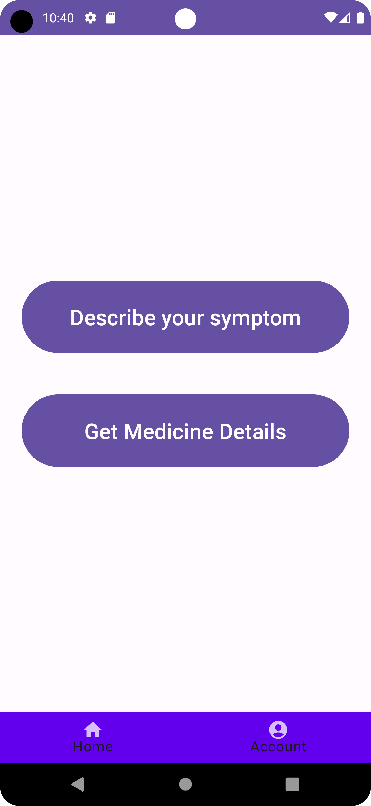
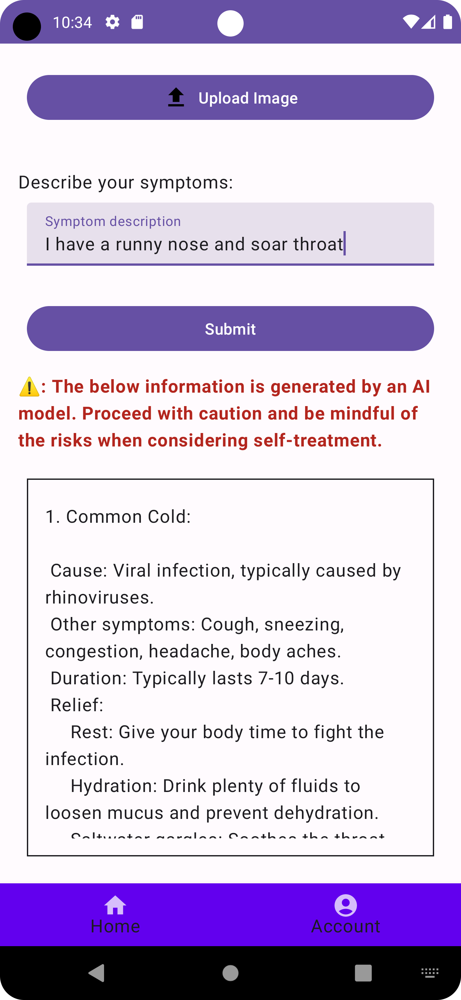
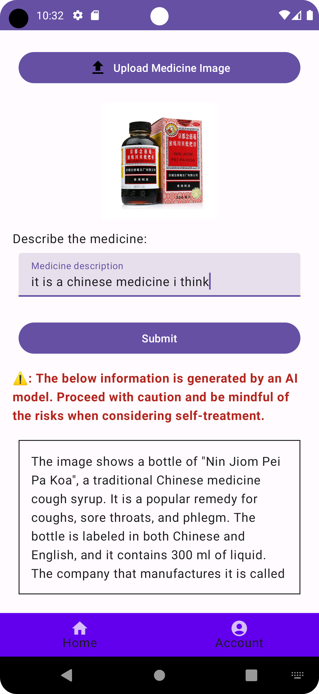
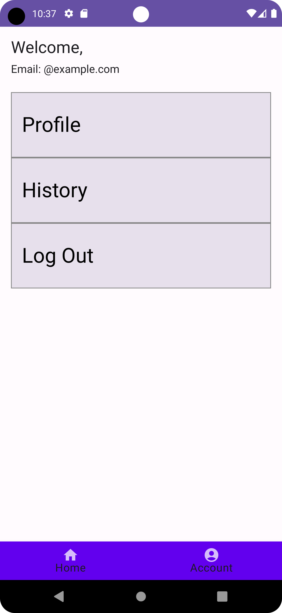
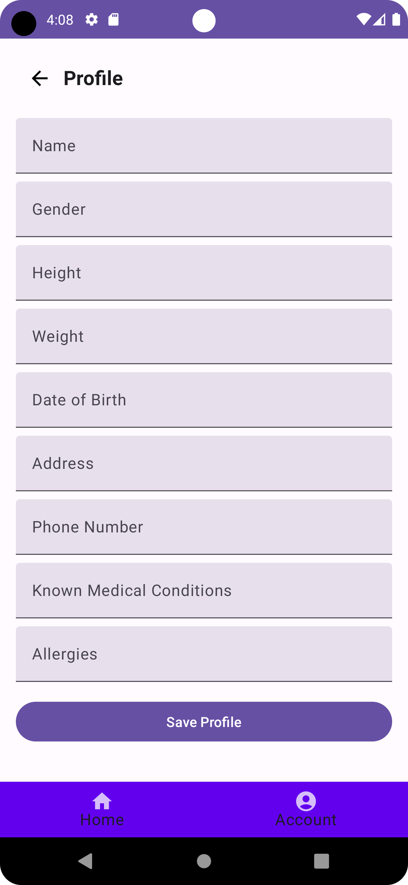
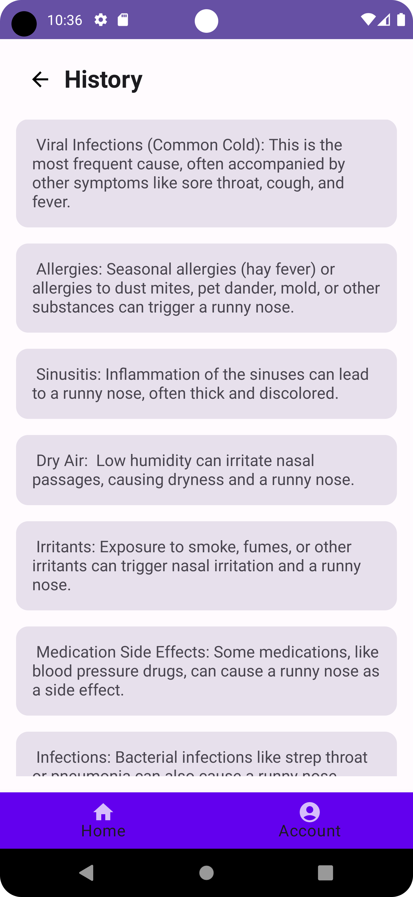

# MedAI

## Motivation

MedAI was developed by a team of four non-native English-speaking women. Our initial goal in the healthcare field was to simplify the recognition of complicated medicine names found in prescriptions. Then, one of our team members pointed out how challenging it can be to understand the vocabulary related to symptoms or describe specific body parts. This led us to design MedAI, an app aimed at reducing the confusion and anxiety we often face when dealing with our health.

## Product Description

### 1. Home Section

The Home section is where users can engage with the core functionalities of the app:

- **Describe Your Symptom Button:** Users can input descriptions of their symptoms and optionally upload an image to receive AI-generated feedback about potential conditions or general health tips.
- **Get Medicine Details Button:** Users can input descriptions of the medicine and optionally upload an image to receive AI-generated feedback about the information and general tips for using it.

These functionalities are powered by an AI generative model, leveraging the Gemini API to process inputs and provide responses based on user input.

### 2. Account Section

The Account section allows users to manage their profile and view their interaction history. Features include:

- **Profile Management:** Displays user details such as name, email, gender, height, weight, and known medical conditions (e.g., allergy). Users can update their profile information.
- **History:** Displays a history of previously submitted symptoms and AI responses, stored locally in a CSV file for easy retrieval.
- **Logout:** Users can securely log out of their account from this section.

### 3. Bottom Navigation

The app features a bottom navigation bar for easy switching between the Home and Account sections. Given that our primary users may be older adults, we prioritized simplicity and high visibility rather than hiding options in a sidebar.

## Technical Details

In the Describe Symptom and Explain Medicine screens, users upload images and text, which are sent to the Gemini AI model via the GenerativeModel API. The AI processes the input, returning details like potential conditions or medicine information. Results are displayed in real-time, stored for history, and include a caution to consult professionals.

## Screenshots
 

